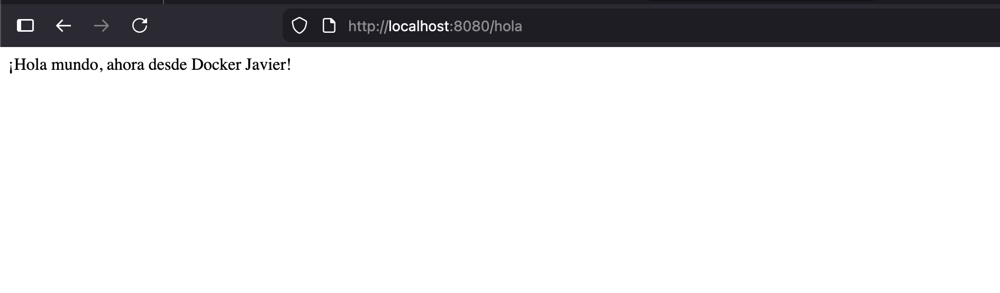

# Laboratorio 2: Spring Boot con Docker

## Descripción
Aplicación REST básica con Spring Boot dockerizada para demostrar:
- Configuración de Spring Boot con Gradle
- Creación de endpoints REST
- Empaquetado con Docker
- Despliegue en contenedores

## Información del Estudiante
- **Nombre:** [Tu nombre]
- **Cédula:** 23626683
- **Curso:** Aplicaciones con Tecnología Internet II

## Tecnologías Utilizadas
- Java 17
- Spring Boot 3.3.5
- Gradle 8.14.3
- Docker
- Mac M1 (ARM64)

## Estructura del Proyecto
```
lab2springboot/
├── src/main/java/com/arquitectura/java/
│   ├── HolaApplication.java      # Clase principal
│   └── HolaController.java        # Controlador REST
├── Dockerfile                     # Configuración Docker
└── build.gradle                   # Configuración Gradle
```

## Instalación y Ejecución

### Requisitos Previos
- Java 17 o superior
- Gradle 8.x
- Docker Desktop

### Ejecución Local (sin Docker)
```bash
# Limpiar proyecto
./gradlew clean

# Construir proyecto
./gradlew build

# Crear JAR ejecutable
./gradlew bootJar

# Ejecutar aplicación
java -jar build/libs/lab2springboot-0.0.1-SNAPSHOT.jar
```

Acceder a: `http://localhost:8080/hola`

### Ejecución con Docker
```bash
# Construir imagen Docker
docker build -t springboot-docker .

# Ejecutar contenedor
docker run -p 8080:8080 springboot-docker
```

Acceder a: `http://localhost:8080/hola`

## Endpoints Disponibles

| Método | Endpoint | Descripción |
|--------|----------|-------------|
| GET    | `/hola`  | Retorna mensaje de saludo |

## Capturas de Pantalla

### Ejecución Local


## Problemas Encontrados y Soluciones

### 1. Clases principales duplicadas
**Error:** `Unable to find a single main class from the following candidates`

**Solución:** Eliminé la clase `DemoApplication.java` generada por Spring Initializr, dejando solo `HolaApplication.java`.

### 2. Tests fallando
**Error:** `DemoApplicationTests > initializationError FAILED`

**Solución:** Eliminé el directorio de tests `src/test/java/com/arquitectura/demo/` que buscaba la clase principal en el paquete incorrecto.

### 3. Imagen Docker incompatible con M1
**Error:** `no match for platform in manifest: not found`

**Solución:** Cambié la imagen base de `eclipse-temurin:17-jdk-alpine` a `amazoncorretto:17-alpine` que sí tiene soporte ARM64.

## Comandos Útiles

### Gradle
```bash
./gradlew tasks              # Ver tareas disponibles
./gradlew build              # Compilar proyecto
./gradlew bootRun            # Ejecutar aplicación
./gradlew clean              # Limpiar build
./gradlew --status           # Ver status de Gradle daemon
./gradlew --stop             # Detener daemon
```

### Docker
```bash
docker images                # Listar imágenes
docker ps                    # Ver contenedores activos
docker ps -a                 # Ver todos los contenedores
docker stop <container_id>   # Detener contenedor
docker rm <container_id>     # Eliminar contenedor
docker rmi <image_id>        # Eliminar imagen
docker logs <container_id>   # Ver logs del contenedor
```

## Conclusiones

### Aprendizajes Clave
1. **Spring Boot simplifica la configuración** - No es necesario configurar servidores web manualmente, Tomcat viene embebido
2. **Gradle vs Maven** - Gradle es más flexible con su DSL basado en Groovy, pero requiere entender su estructura
3. **Docker elimina el "funciona en mi máquina"** - El contenedor garantiza consistencia entre desarrollo y producción
4. **Arquitectura ARM requiere atención** - No todas las imágenes Docker tienen soporte para M1/M2, hay que verificar compatibilidad

### Dificultades Enfrentadas
- Configurar correctamente los paquetes Java siguiendo el patrón esperado por Spring Boot
- Encontrar imágenes Docker compatibles con arquitectura ARM64
- Entender la diferencia entre `./gradlew build` y `./gradlew bootJar`

### Ventajas de Docker Observadas
- **Portabilidad:** El mismo contenedor funciona en cualquier máquina con Docker
- **Aislamiento:** La aplicación no interfiere con otras aplicaciones del sistema
- **Reproducibilidad:** Mismo comportamiento en desarrollo, testing y producción
- **Facilidad de deployment:** Un solo comando para levantar toda la aplicación

## Referencias
- [Spring Boot Documentation](https://spring.io/projects/spring-boot)
- [Gradle User Guide](https://docs.gradle.org/)
- [Docker Documentation](https://docs.docker.com/)
- [Eclipse Temurin ARM64 Support](https://adoptium.net/)

## Autor
Javier Darder - 23626683